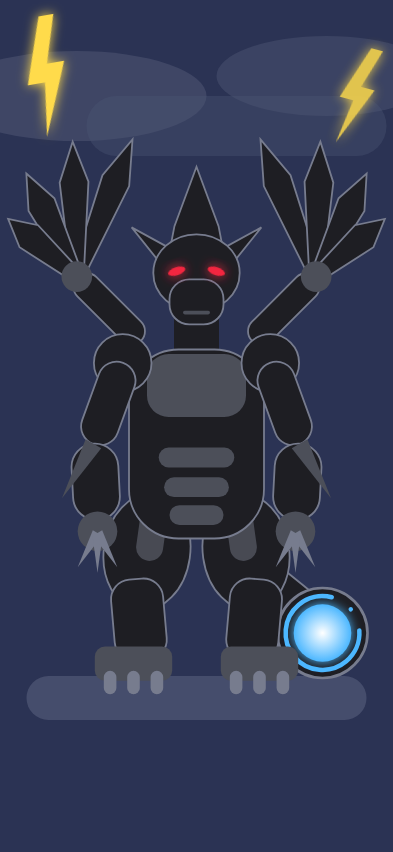

# Zekrom Shapes — 用形狀畫捷克羅姆

作業：[#206 參考 Apple 的 Build with Stacks and Shapes 用形狀創作有趣圖案](https://medium.com/%E5%BD%BC%E5%BE%97%E6%BD%98%E7%9A%84%E8%A9%A6%E7%85%89-%E5%8B%87%E8%80%85%E7%9A%84-100-%E9%81%93-swift-ios-app-%E8%AC%8E%E9%A1%8C/206-%E5%8F%83%E8%80%83-apple-%E7%9A%84-build-with-stacks-and-shapes-%E7%94%A8%E5%BD%A2%E7%8B%80%E5%89%B5%E4%BD%9C%E8%87%AA%E7%95%AB%E5%83%8F-self-portrait-b4d4a8eef55e)

用 SwiftUI 內建形狀加上幾個自訂 `Shape`，畫出在雷雨夜空下的傳說寶可夢捷克羅姆（Zekrom #644）。參考圖：[Poképédia Miniature 0644](https://www.pokepedia.fr/images/a/ae/Miniature_0644_EV.png)。



> 上圖是用 `tools/zekrom_gen.py` 輸出的 SVG 預覽，座標與 SwiftUI 程式相同，實際 iPhone 畫面的陰影、描邊會略有差異。

## 作業需求對照

| 需求 | 做法 |
|---|---|
| 使用各種形狀 | `Rectangle`（脖子）、`Circle`（肩膀、手、發電機）、`Ellipse`（臉、大腿、雷雲、眼睛）、`Capsule`（手臂、翅膀骨架、腹甲、腳爪）、`RoundedRectangle`（軀幹、小腿、口鼻）、`UnevenRoundedRectangle`（胸甲、腳掌） |
| ZStack 堆疊 | `ContentView` 外層 ZStack 疊背景、雷雲、Zekrom；Zekrom 本身再由後往前疊尾巴 → 翅膀 → 腿 → 身體 → 手臂 → 頭 |
| modifier 調整形狀 | `frame`、`offset`、`rotationEffect`、`fill`、`stroke`、`trim`、`opacity`、`shadow`、`scaleEffect` |
| 全螢幕背景顏色 | `Color.stormSky.ignoresSafeArea()` |
| Assets 設定顏色 RGB | `Assets.xcassets` 裡 8 個 Color Set（StormSky、CloudGray、BoltYellow、ZekromBlack、ZekromGray、ZekromEdge、ZekromRed、ZekromBlue），以 Xcode 自動產生的 `Color.zekromBlack` 等名稱使用 |
| 主要部位註解 | 每個部位（翅膀、尾巴、腿、身體、手臂、頭）各自是一個 View，每個部位上方都有中文註解 |

加分項目：

- 線條、旋轉、陰影、透明度：灰藍色描邊（`stroke`）、翅膀與爪子旋轉、閃電與紅眼睛用同色 `shadow` 做出發光效果、雷雲半透明。
- 漸層：尾巴發電機核心用白到藍的 `RadialGradient`。
- 自訂形狀：`Blade`（翅膀羽刃）、`Spike`（尖角、爪子）、`Crest`（頭頂角冠）、`Bolt`（閃電）。
- `Circle().trim(from:to:)` 畫出缺一角的藍色電流環。
- 左右對稱的部位用 `ForEach(sides)`，把 x 位移與旋轉角度乘上 `side`（-1 或 1），同一段程式畫出左右兩邊。

## 程式怎麼產生的

手動調整幾十個形狀的座標很花時間，所以先寫了 `tools/zekrom_gen.py` 當「設計稿」：

1. 在 Python 裡列出每個部位的形狀、大小、位置、角度、顏色與註解。手臂、翅膀這類長條形用「起點到終點」描述，程式會算出 `frame`、`rotationEffect` 與 `offset`。
2. `python3 tools/zekrom_gen.py svg docs/preview.svg` 輸出 SVG，在 Linux 上用 Chrome 截圖預覽，反覆調整比例。
3. 滿意後用 `swift` 產生 `ContentView.swift`，用 `assets` 產生 Assets 的顏色設定：

```sh
python3 tools/zekrom_gen.py swift ZekromShapes/Sources/ContentView.swift
python3 tools/zekrom_gen.py assets ZekromShapes/Assets.xcassets
```

App icon 是同一張 SVG 裁切上半身後輸出的 1024×1024 圖片。

## 執行

Mac 上 clone 後開啟 `ZekromShapes.xcodeproj`，在 Signing & Capabilities 選擇自己的 Team，執行到 iPhone 模擬器或實機（iOS 17 以上，使用 `UnevenRoundedRectangle` 與 `fill` + `stroke` 連用）。

`ZekromShapes.xcodeproj` 是在沒有 Xcode 的環境依照 [TimerCam](https://github.com/Yogurtheyork/TimerCam) 專案手寫產生，程式尚未經過 Xcode 編譯與模擬器實測；若有錯誤，以 Xcode 提示修正後再 commit，並補上模擬器截圖。

## 檔案

- `ZekromShapes/Sources/ZekromShapesApp.swift`：App 入口。
- `ZekromShapes/Sources/ContentView.swift`：整張圖，分成 `StormBackdrop`、`ZekromTail`、`ZekromWings`、`ZekromLegs`、`ZekromTorso`、`ZekromArms`、`ZekromHead` 與四個自訂形狀。
- `ZekromShapes/Assets.xcassets`：顏色與 App icon。
- `tools/zekrom_gen.py`：設計稿與程式產生器。
- `docs/preview.svg`、`docs/preview.png`：預覽圖。

捷克羅姆（Zekrom）為 Nintendo / Creatures / GAME FREAK 的角色，本專案僅為課程練習。
